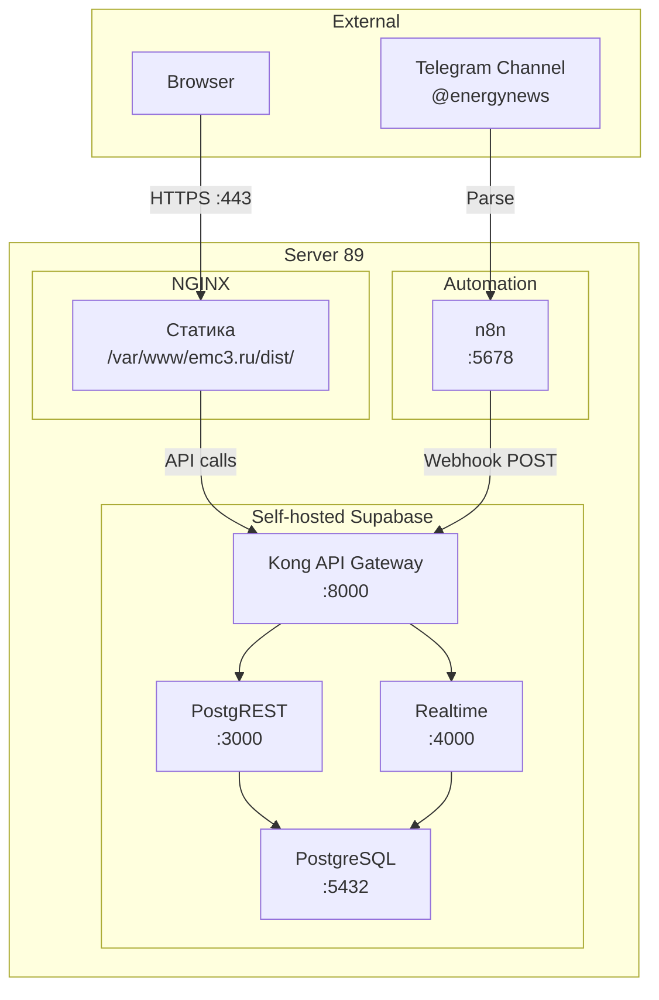
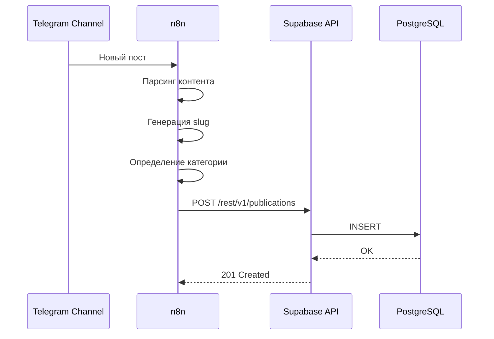

# EMC³ Energy Solutions — Документация по деплою

## 📋 Общая информация

| Параметр | Значение |
|----------|----------|
| **Проект** | `ems-energy-solutions` |
| **Домен** | emc3.ru |
| **Целевой сервер** | Server 89 |
| **Архитектура** | SPA + Self-hosted Supabase |
| **Тип приложения** | Корпоративный сайт с новостным разделом |

---

## 🛠 Технологический стек

### Frontend

| Технология | Версия | Назначение |
|------------|--------|------------|
| React | 18.3.1 | UI библиотека |
| Vite | 5.4.19 | Сборщик |
| TypeScript | 5.8.3 | Типизация |
| Tailwind CSS | 3.4.17 | Стилизация |
| shadcn/ui (Radix) | - | UI компоненты |
| React Router DOM | 6.30.1 | Маршрутизация |
| TanStack Query | 5.83.0 | Управление состоянием запросов |
| react-helmet-async | 2.0.5 | SEO метаданные |

### Backend (Self-hosted)

| Компонент | Назначение |
|-----------|------------|
| Supabase | BaaS платформа |
| PostgreSQL | База данных |
| PostgREST | REST API |
| Supabase Realtime | WebSocket подписки |

### Автоматизация

| Инструмент | Назначение |
|------------|------------|
| n8n | Парсинг Telegram → Supabase |

---

## 📁 Структура проекта

```
ems-energy-solutions/
├── public/
│   ├── favicon.png
│   ├── og-image.jpg
│   ├── robots.txt
│   ├── sitemap.xml
│   └── videos/
│       └── hero-bg.mp4
├── src/
│   ├── assets/
│   │   ├── emc3-cube.png
│   │   └── emc3-logo.png
│   ├── components/
│   │   ├── ui/                    # shadcn/ui компоненты
│   │   ├── layout/
│   │   │   └── PageLayout.tsx
│   │   ├── news/
│   │   │   ├── CategoryFilter.tsx
│   │   │   ├── NewsCard.tsx
│   │   │   ├── NewsSection.tsx
│   │   │   ├── NewsSlider.tsx
│   │   │   └── ShareButton.tsx
│   │   ├── products/
│   │   │   ├── PricingTable.tsx
│   │   │   ├── ProductCard.tsx
│   │   │   └── UseCaseCard.tsx
│   │   ├── About.tsx
│   │   ├── Contact.tsx
│   │   ├── Directions.tsx
│   │   ├── ESCODiagram.tsx
│   │   ├── Footer.tsx
│   │   ├── Header.tsx
│   │   ├── Hero.tsx
│   │   ├── NavLink.tsx
│   │   ├── Portal.tsx
│   │   ├── Projects.tsx
│   │   ├── SEO.tsx
│   │   └── Values.tsx
│   ├── hooks/
│   │   ├── useNews.ts             # ⚠️ Требует обновления
│   │   ├── use-mobile.tsx
│   │   ├── use-toast.ts
│   │   └── useScrollAnimation.tsx
│   ├── integrations/
│   │   └── supabase/
│   │       ├── client.ts          # ⚠️ Требует обновления
│   │       └── types.ts           # ⚠️ Требует генерации
│   ├── pages/
│   │   ├── Content.tsx
│   │   ├── Energy.tsx
│   │   ├── Index.tsx
│   │   ├── News.tsx
│   │   ├── NewsArticle.tsx
│   │   ├── NotFound.tsx
│   │   └── Platform.tsx
│   ├── types/
│   │   └── news.ts
│   ├── lib/
│   │   └── utils.ts
│   ├── App.tsx
│   ├── main.tsx
│   └── index.css
├── supabase/
│   └── config.toml
├── .env                            # Lovable Cloud (не использовать в prod)
├── .env.production                 # ⚠️ Требуется создать
├── DEPLOYMENT.md
├── index.html
├── tailwind.config.ts
├── vite.config.ts
└── package.json
```

---

## 🗺 Маршруты приложения

| Маршрут | Компонент | Описание |
|---------|-----------|----------|
| `/` | `Index` | Главная страница |
| `/energy` | `Energy` | Энергетические решения |
| `/platform` | `Platform` | Платформа |
| `/content` | `Content` | Контент |
| `/news` | `News` | Список новостей |
| `/news/:slug` | `NewsArticle` | Статья новости |
| `*` | `NotFound` | 404 страница |

---

## 🏗 Архитектура деплоя



### Порты и сервисы

| Сервис | Порт | Описание |
|--------|------|----------|
| NGINX | 80, 443 | Фронтенд + SSL |
| Kong (Supabase) | 8000 | API Gateway |
| PostgREST | 3000 | REST API |
| Realtime | 4000 | WebSocket |
| PostgreSQL | 5432 | База данных |
| n8n | 5678 | Автоматизация |

---

## 🗄 Схема базы данных

### Таблица `publications`

```sql
-- Создание таблицы publications
CREATE TABLE public.publications (
    id UUID PRIMARY KEY DEFAULT gen_random_uuid(),
    news_id VARCHAR(50) UNIQUE NOT NULL,
    original_id INTEGER,
    title TEXT NOT NULL,
    slug VARCHAR(255) UNIQUE NOT NULL,
    full_text TEXT NOT NULL,
    plain_text TEXT,
    short_description TEXT,
    publication_date TIMESTAMP WITH TIME ZONE NOT NULL DEFAULT now(),
    published_at TIMESTAMP WITH TIME ZONE NOT NULL DEFAULT now(),
    category VARCHAR(100) NOT NULL DEFAULT 'Энергетика',
    image_url TEXT,
    views_count INTEGER NOT NULL DEFAULT 0,
    likes_count INTEGER NOT NULL DEFAULT 0,
    source VARCHAR(20) NOT NULL DEFAULT 'telegram' CHECK (source IN ('telegram', 'manual')),
    telegram_post_id VARCHAR(50),
    created_at TIMESTAMP WITH TIME ZONE NOT NULL DEFAULT now(),
    updated_at TIMESTAMP WITH TIME ZONE NOT NULL DEFAULT now()
);

-- Индексы для оптимизации
CREATE INDEX idx_publications_slug ON public.publications(slug);
CREATE INDEX idx_publications_category ON public.publications(category);
CREATE INDEX idx_publications_published_at ON public.publications(published_at DESC);
CREATE INDEX idx_publications_source ON public.publications(source);

-- Триггер для автообновления updated_at
CREATE OR REPLACE FUNCTION public.update_updated_at_column()
RETURNS TRIGGER AS $$
BEGIN
    NEW.updated_at = now();
    RETURN NEW;
END;
$$ LANGUAGE plpgsql;

CREATE TRIGGER update_publications_updated_at
    BEFORE UPDATE ON public.publications
    FOR EACH ROW
    EXECUTE FUNCTION public.update_updated_at_column();

-- RLS политики
ALTER TABLE public.publications ENABLE ROW LEVEL SECURITY;

-- Публичное чтение (для всех посетителей сайта)
CREATE POLICY "Publications are publicly readable"
    ON public.publications
    FOR SELECT
    USING (true);

-- Вставка только через service_role (n8n webhook)
CREATE POLICY "Service role can insert publications"
    ON public.publications
    FOR INSERT
    WITH CHECK (auth.role() = 'service_role');

-- Обновление только через service_role
CREATE POLICY "Service role can update publications"
    ON public.publications
    FOR UPDATE
    USING (auth.role() = 'service_role');

-- Realtime подписки
ALTER PUBLICATION supabase_realtime ADD TABLE public.publications;
```

### Таблица `contact_requests` (опционально)

```sql
CREATE TABLE public.contact_requests (
    id UUID PRIMARY KEY DEFAULT gen_random_uuid(),
    name VARCHAR(255) NOT NULL,
    email VARCHAR(255) NOT NULL,
    phone VARCHAR(50),
    company VARCHAR(255),
    message TEXT NOT NULL,
    status VARCHAR(20) NOT NULL DEFAULT 'new' CHECK (status IN ('new', 'processing', 'completed', 'spam')),
    created_at TIMESTAMP WITH TIME ZONE NOT NULL DEFAULT now()
);

ALTER TABLE public.contact_requests ENABLE ROW LEVEL SECURITY;

-- Анонимная вставка (форма на сайте)
CREATE POLICY "Anyone can submit contact request"
    ON public.contact_requests
    FOR INSERT
    WITH CHECK (true);

-- Чтение только через service_role
CREATE POLICY "Service role can read contact requests"
    ON public.contact_requests
    FOR SELECT
    USING (auth.role() = 'service_role');
```

---

## ⚙️ Изменения для Production

### 1. Создать `.env.production`

```env
# Self-hosted Supabase на Server 89
VITE_SUPABASE_URL=https://supabase.emc3.ru
VITE_SUPABASE_ANON_KEY=your-anon-key-here
VITE_SUPABASE_PROJECT_ID=emc3-energy
```

### 2. Обновить `src/integrations/supabase/client.ts`

```typescript
import { createClient } from '@supabase/supabase-js';
import type { Database } from './types';

const supabaseUrl = import.meta.env.VITE_SUPABASE_URL;
const supabaseAnonKey = import.meta.env.VITE_SUPABASE_ANON_KEY;

if (!supabaseUrl || !supabaseAnonKey) {
  throw new Error('Missing Supabase environment variables');
}

export const supabase = createClient<Database>(supabaseUrl, supabaseAnonKey, {
  auth: {
    storage: localStorage,
    persistSession: true,
    autoRefreshToken: true,
  }
});
```

### 3. Сгенерировать типы из self-hosted Supabase

```bash
# Установить Supabase CLI
npm install -g supabase

# Сгенерировать типы
npx supabase gen types typescript \
  --project-id emc3-energy \
  --schema public \
  > src/integrations/supabase/types.ts
```

### 4. Обновить `src/hooks/useNews.ts`

```typescript
import { useQuery, useInfiniteQuery } from '@tanstack/react-query';
import { supabase } from '@/integrations/supabase/client';
import { NewsItem } from '@/types/news';

const PAGE_SIZE = 12;

export const useNewsList = (category: string = 'Все') => {
  return useInfiniteQuery({
    queryKey: ['news', category],
    queryFn: async ({ pageParam = 0 }) => {
      let query = supabase
        .from('publications')
        .select('*')
        .order('published_at', { ascending: false })
        .range(pageParam * PAGE_SIZE, (pageParam + 1) * PAGE_SIZE - 1);

      if (category !== 'Все') {
        query = query.eq('category', category);
      }

      const { data, error } = await query;

      if (error) throw error;

      return {
        items: data as NewsItem[],
        nextPage: data.length === PAGE_SIZE ? pageParam + 1 : undefined,
      };
    },
    getNextPageParam: (lastPage) => lastPage.nextPage,
    initialPageParam: 0,
  });
};

export const useLatestNews = (limit: number = 10) => {
  return useQuery({
    queryKey: ['latestNews', limit],
    queryFn: async () => {
      const { data, error } = await supabase
        .from('publications')
        .select('*')
        .order('published_at', { ascending: false })
        .limit(limit);

      if (error) throw error;
      return data as NewsItem[];
    },
  });
};

export const useNewsArticle = (slug: string) => {
  return useQuery({
    queryKey: ['newsArticle', slug],
    queryFn: async () => {
      const { data, error } = await supabase
        .from('publications')
        .select('*')
        .eq('slug', slug)
        .single();

      if (error) throw error;
      return data as NewsItem;
    },
    enabled: !!slug,
  });
};
```

### 5. Обновить `src/components/Contact.tsx`

```typescript
// Добавить функцию отправки формы
const handleSubmit = async (e: React.FormEvent) => {
  e.preventDefault();
  
  const { error } = await supabase
    .from('contact_requests')
    .insert({
      name: formData.name,
      email: formData.email,
      phone: formData.phone,
      company: formData.company,
      message: formData.message,
    });

  if (error) {
    toast.error('Ошибка отправки. Попробуйте позже.');
    return;
  }

  toast.success('Заявка отправлена!');
  setFormData({ name: '', email: '', phone: '', company: '', message: '' });
};
```

---

## 🌐 NGINX конфигурация

### `/etc/nginx/sites-available/emc3.ru`

```nginx
server {
    listen 80;
    server_name emc3.ru www.emc3.ru;
    return 301 https://$server_name$request_uri;
}

server {
    listen 443 ssl http2;
    server_name emc3.ru www.emc3.ru;

    # SSL сертификаты (Let's Encrypt)
    ssl_certificate /etc/letsencrypt/live/emc3.ru/fullchain.pem;
    ssl_certificate_key /etc/letsencrypt/live/emc3.ru/privkey.pem;
    ssl_protocols TLSv1.2 TLSv1.3;
    ssl_ciphers ECDHE-ECDSA-AES128-GCM-SHA256:ECDHE-RSA-AES128-GCM-SHA256;
    ssl_prefer_server_ciphers off;

    # Корневая директория
    root /var/www/emc3.ru/dist;
    index index.html;

    # Gzip сжатие
    gzip on;
    gzip_vary on;
    gzip_min_length 1024;
    gzip_proxied any;
    gzip_types text/plain text/css text/xml text/javascript 
               application/javascript application/x-javascript 
               application/xml application/json image/svg+xml;

    # SPA fallback — все маршруты на index.html
    location / {
        try_files $uri $uri/ /index.html;
    }

    # Кэширование статических ресурсов
    location ~* \.(js|css|png|jpg|jpeg|gif|ico|svg|woff|woff2|ttf|eot|mp4|webm)$ {
        expires 1y;
        add_header Cache-Control "public, immutable";
        access_log off;
    }

    # Отключить кэширование HTML
    location ~* \.html$ {
        expires -1;
        add_header Cache-Control "no-store, no-cache, must-revalidate";
    }

    # Безопасность
    add_header X-Frame-Options "SAMEORIGIN" always;
    add_header X-Content-Type-Options "nosniff" always;
    add_header X-XSS-Protection "1; mode=block" always;
    add_header Referrer-Policy "strict-origin-when-cross-origin" always;

    # Логи
    access_log /var/log/nginx/emc3.ru.access.log;
    error_log /var/log/nginx/emc3.ru.error.log;
}
```

### Активация конфига

```bash
sudo ln -s /etc/nginx/sites-available/emc3.ru /etc/nginx/sites-enabled/
sudo nginx -t
sudo systemctl reload nginx
```

---

## 🚀 Процесс деплоя

### Первоначальная настройка сервера

```bash
# 1. Создать директорию
sudo mkdir -p /var/www/emc3.ru/dist
sudo chown -R $USER:$USER /var/www/emc3.ru

# 2. Установить SSL сертификат
sudo certbot --nginx -d emc3.ru -d www.emc3.ru

# 3. Настроить NGINX
sudo nano /etc/nginx/sites-available/emc3.ru
sudo ln -s /etc/nginx/sites-available/emc3.ru /etc/nginx/sites-enabled/
sudo nginx -t && sudo systemctl reload nginx
```

### Сборка и деплой

```bash
# Локально
npm run build

# Загрузка на сервер
scp -r dist/* user@server89:/var/www/emc3.ru/dist/

# Или через rsync (предпочтительно)
rsync -avz --delete dist/ user@server89:/var/www/emc3.ru/dist/
```

### CI/CD скрипт (опционально)

```bash
#!/bin/bash
# deploy.sh

set -e

echo "🔨 Building..."
npm run build

echo "📦 Deploying to server 89..."
rsync -avz --delete \
  --exclude '.git' \
  --exclude 'node_modules' \
  dist/ user@server89:/var/www/emc3.ru/dist/

echo "✅ Deployed successfully!"
```

---

## 🔗 Взаимодействие с другими сервисами

### Портал решений

| Параметр | Значение |
|----------|----------|
| Взаимодействие | Нет прямого взаимодействия |
| Примечание | Отдельное приложение на том же сервере |

### n8n (Telegram → Supabase)



#### n8n Workflow конфигурация

```json
{
  "name": "Telegram to Supabase",
  "nodes": [
    {
      "type": "n8n-nodes-base.telegramTrigger",
      "parameters": {
        "channel": "@energynews"
      }
    },
    {
      "type": "n8n-nodes-base.function",
      "parameters": {
        "functionCode": "// Парсинг и генерация slug"
      }
    },
    {
      "type": "n8n-nodes-base.httpRequest",
      "parameters": {
        "url": "https://supabase.emc3.ru/rest/v1/publications",
        "method": "POST",
        "headers": {
          "apikey": "{{ $env.SUPABASE_SERVICE_KEY }}",
          "Authorization": "Bearer {{ $env.SUPABASE_SERVICE_KEY }}",
          "Content-Type": "application/json"
        }
      }
    }
  ]
}
```

---

## ✅ TODO чеклист

### Подготовка

- [ ] Создать `.env.production` с credentials self-hosted Supabase
- [ ] Сгенерировать типы из self-hosted Supabase
- [ ] Создать таблицу `publications` в self-hosted Supabase
- [ ] Создать таблицу `contact_requests` (опционально)
- [ ] Настроить RLS политики

### Код

- [ ] Обновить `src/integrations/supabase/client.ts`
- [ ] Обновить `src/hooks/useNews.ts` — убрать MOCK_NEWS
- [ ] Реализовать отправку формы в `src/components/Contact.tsx`
- [ ] Тестировать локально с production env

### Сервер

- [ ] Настроить NGINX конфиг для emc3.ru
- [ ] Получить SSL сертификат (Let's Encrypt)
- [ ] Создать директорию `/var/www/emc3.ru/dist`
- [ ] Настроить права доступа

### Автоматизация

- [ ] Настроить n8n workflow для парсинга Telegram
- [ ] Настроить webhook в n8n → Supabase
- [ ] Тестировать автоимпорт новостей

### Финализация

- [ ] Выполнить первый деплой
- [ ] Проверить все маршруты
- [ ] Проверить загрузку новостей из БД
- [ ] Проверить отправку формы контактов
- [ ] Настроить мониторинг (uptime, ошибки)

---

## 🔒 Безопасность

### Переменные окружения

| Переменная | Где хранить | Доступ |
|------------|-------------|--------|
| `VITE_SUPABASE_URL` | `.env.production` | Публичный |
| `VITE_SUPABASE_ANON_KEY` | `.env.production` | Публичный |
| `SUPABASE_SERVICE_KEY` | n8n secrets | Приватный |

### CORS настройки в Supabase

```sql
-- В конфиге Kong/Supabase
-- Разрешить только emc3.ru
ALTER SYSTEM SET "app.cors_allowed_origins" = 'https://emc3.ru,https://www.emc3.ru';
```

### RLS политики

| Таблица | SELECT | INSERT | UPDATE | DELETE |
|---------|--------|--------|--------|--------|
| `publications` | public | service_role | service_role | service_role |
| `contact_requests` | service_role | public | - | - |

---

## 📞 Контакты

| Роль | Контакт |
|------|---------|
| DevOps | - |
| Backend | - |
| Frontend | - |

---

*Документ создан: 2025-01-12*
*Последнее обновление: 2025-01-12*
